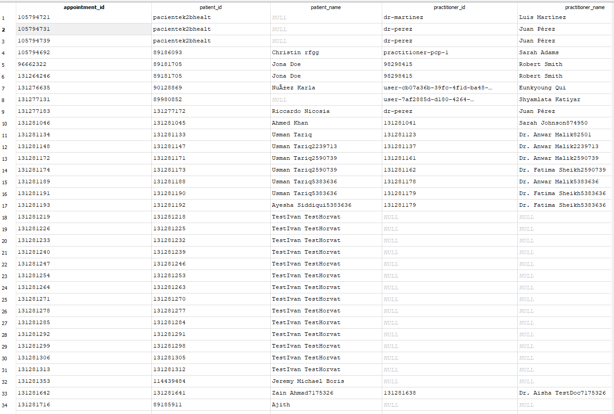

# 🏥 Patient Visit Funnel Dashboard (FHIR API)

## 📊 Overview

End-to-end analytics project based on open FHIR API data.

Goal: build a **patient funnel from scheduled appointment to completed visit**.

---

## 📸 Dashboard



---

## 🎯 Business Problem

In healthcare systems, appointments and visits (encounters) are often **not directly linked**.

A naive join between these entities can significantly **overestimate conversion rates**, leading to incorrect business conclusions.

---

## 🧠 Solution

Implemented a **time-based matching logic**:

* linked each appointment to the **nearest encounter in time**
* filtered only relevant visit statuses (`finished`)
* avoided duplicate or incorrect matches

This approach produced a **realistic patient funnel**.

---

## 📈 Key Metrics

* Appointments: **1,852**
* Unique patients: **328**
* Completed visits: **129**
* Conversion rate: **6.97%**

---

## 🔍 Key Insight

A naive join produced:

* ~47% conversion ❌ (incorrect)

After implementing proper matching:

* ~7% conversion ✅ (realistic)

👉 Root cause: incorrect linking between appointments and encounters
👉 Fix: time-based matching per patient

---

## ⚙️ Data Pipeline

**FHIR API → Python ETL → SQLite → SQL Mart → Dashboard**

### Data extraction

* Source: HAPI FHIR test server
* Resources:

  * Patient
  * Appointment
  * Encounter
  * Practitioner

### Processing

* JSON parsing
* normalization of nested structures
* loading into staging tables

### Storage

* SQLite
* staging:

  * `stg_patients`
  * `stg_practitioners`
  * `stg_appointments`
  * `stg_encounters`

---

## 🧮 Data Modeling (SQL)

Main mart:

```sql
mart_patient_visit_funnel_v2
```

Key logic:

```sql
visit_completed_flag = case 
  when encounter_status = 'finished' then 1 
  else 0 
end
```

Matching approach:

* join by `patient_id`
* select nearest encounter by time difference
* avoid many-to-many duplication

---

## 📊 Visualization

Dashboard shows:

* appointments over time
* completed visits over time
* overall conversion

Tool:

* Excel (Pivot + Charts)

---

## 🛠️ Tech Stack

* Python (Requests, Pandas)
* SQL
* SQLite
* Excel
* FHIR API

---

## 🧠 Skills Demonstrated

* API data extraction (FHIR)
* JSON normalization
* Data modeling (staging → mart)
* SQL joins and business logic
* Handling data quality issues
* Analytical thinking (conversion correction)
* Dashboard building

---

## 📦 Repository Structure

```
src/            # Python ETL scripts
sql/            # SQL logic and transformations
screenshots/    # dashboard preview
output/         # mart sample
```

---

## 📈 Business Value

This approach can be used in real clinics to:

* track patient conversion
* identify no-show patterns
* evaluate doctor performance
* improve scheduling efficiency

---

## 🚀 Next Steps

* add no-show analysis
* conversion by practitioner
* cohort analysis of returning patients
* migrate dashboard to BI tool (Power BI / Looker)

---

## 👤 Author

Roman
Data / Business Analyst
